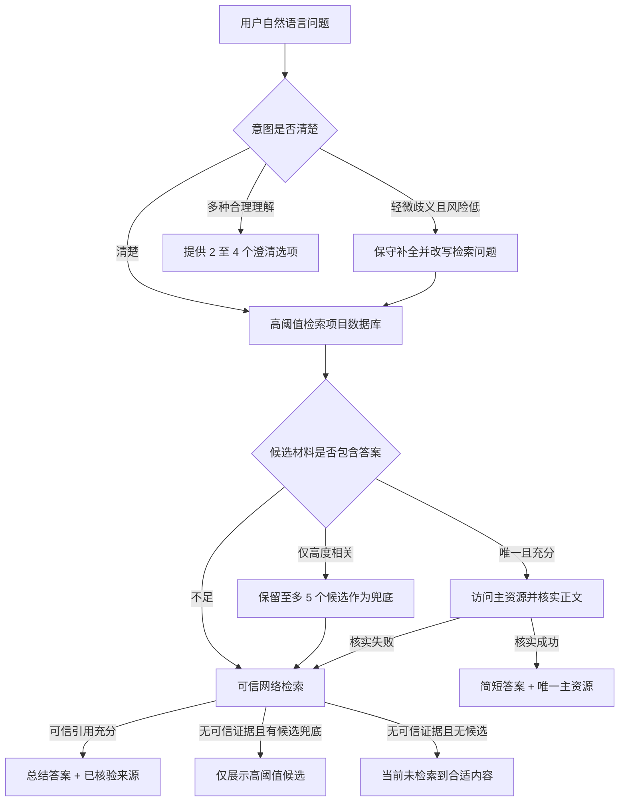

# 中国科学技术大学 AI 资源导航助手

> 107 杯智能算力开发赛参赛项目 | 数据库优先、证据可核验、面向行动的校园资源导航系统

[项目仓库](https://github.com/wriontsuso-cpu/107AgentContests) | [静态演示](https://wriontsuso-cpu.github.io/107AgentContests/) | [数据接口规范](https://github.com/wriontsuso-cpu/107AgentContests/blob/main/%E6%95%B0%E6%8D%AE%E6%8E%A5%E5%8F%A3%E8%A7%84%E8%8C%83.md)

## 项目简介

新生通常知道自己想完成什么，却不知道应该访问哪个部门、系统或通知页面。例如：“学生证怎么补办”“图书馆学习空间在哪里预约”“最近有什么可以参加的竞赛”。传统搜索会返回大量标题相似、已经过期或只有背景关联的页面，通用聊天模型则可能给出缺少依据的流程和链接。

本项目将分散在中国科学技术大学官网、职能部门网站、办事指南和公开通知中的资源整理为结构化目录，并让 AI 承担“理解需求、核实证据、选择入口”的工作。系统不会追求长对话，而是尽快给出：

1. 针对当前问题的简短结论；
2. 可以直接行动的官方资源入口；
3. 页面内容、数据库快照或可信网页等证据来源；
4. 在无法可靠判断时，少量且具体的澄清选项。

一句话概括：**用户只需要描述想办的事，系统负责找到、核实并交付真正可用的校园资源。**

## 当前成果

| 指标 | 当前状态 |
| --- | --- |
| 原始数据 | 12812 条，覆盖 39 个校园栏目 |
| 发布数据包 | 12382 条；已排除 430 条重复、失效、状态未知、错链或缺失本地文件的记录 |
| AI 可推荐资源 | 10091 条；后端进一步过滤 2291 条 `deprecate` 记录 |
| 内容增强覆盖 | `content_info`、`search_text`、`weight`、`relevance_score`、审核与链接状态字段覆盖 100% 发布记录 |
| 受限但有效的入口 | 保留 125 条需要登录或受限访问的资源，并在结果中提示访问条件 |
| 自动化验证 | 207 项通过：后端 38、数据脚本 9、前端单元测试 123、桌面/移动端流程 37；另有 1 项按设备条件跳过 |
| 产品形态 | 响应式资源目录、资源详情、AI 导航、引导式追问、本机搜索与会话历史、静态演示模式 |

数据口径对应 2026-09-02 发布版本，代码状态以仓库最新 `main` 为准。

## 核心优势

### 1. 目标是完成任务，而不是延长对话

系统将回答控制在“结论 + 操作方式 + 资源入口”的范围内。问题已经清楚时直接导航；只有在不同理解会导向不同资源时，才提供 2 至 4 个具体选项继续确认。轻微歧义且风险较低时，系统会保守补全意图，而不会让用户重复描述已经提供的信息。

### 2. 相关资源不等于正确答案

这是本系统与普通关键词搜索、简单 RAG 的关键区别。

数据库检索结果首先只是候选。候选的标题、栏目或业务领域与问题相关，并不能证明页面包含答案。系统必须继续检查数据库正文、内容摘要或实际网页正文，确认其中明确出现回答问题所需的信息，才会把它判定为命中。

例如，用户询问学校税号时，检索到“财务报销”页面并不足以回答；只有页面中确实包含税号，才允许形成数据库答案，否则继续进入可信网络检索。

### 3. 按置信度控制结果数量

系统不会为了凑满固定的 `top 5` 而推送弱相关资源：

- 存在唯一且证据充分的答案时，只返回该主资源；
- 没有唯一答案但存在多个高相关结果时，最多返回 5 个；
- 所有候选都低于高相关阈值时，直接返回“当前未检索到合适内容”；
- LLM 核实失败时，不把未经核实的候选暴露给用户。

这种策略减少了“看起来相关、实际上无用”的链接，也让用户更快做出下一步行动。

### 4. 数据库优先，可信网络兜底

完整证据顺序为：

```text
项目数据库 -> 数据库内容或目标页面核实 -> 可信网络检索 -> 明确未找到
```

只有数据库没有候选，或候选内容不能回答问题时，系统才允许启用模型提供商的网页搜索工具。联网结果必须同时通过以下检查：

- 引用来自配置允许的可信域名，默认包括 `ustc.edu.cn`、`edu.cn`、`gov.cn`；
- 结论由实际引用页面正文支持，而不是只依据搜索摘要；
- 后端重新生成来源等级，不采信模型自述；
- 回答中的 URL 必须出现在后端核验后的引用集合中；
- 没有可信引用时不使用模型记忆补写答案。

因此，系统既能利用校内数据库的稳定性，也不会在数据库缺项时被迫沉默或随意编造。

### 5. 面向中文校园场景的检索

检索并非简单字符串包含，而是结合：

- 校园常用词与同义词，例如“座位”可关联“学习空间”；
- 常见拼音别名，例如 `tushuguan` 可关联“图书馆”；
- 1 个汉字的编辑距离容错，例如“图书管”仍可被理解；
- 标题、标签、栏目、摘要、正文和 `search_text` 的字段权重；
- 每条资源 0 至 10 的业务权重，高频官方入口优先，新闻报道降权；
- 精确姓名识别，使长通知末尾的教师姓名等细节不被泛化页面淹没；
- 负向意图与对象一致性校验，避免把名称相近的服务互相替代。

### 6. 可解释、可追溯、可降级

每个可点击结果都要经过前后端双重校验。回答会区分“已访问的实时页面”和“仅依据数据库快照”，不会声称访问了实际未打开的页面。单个资源的前端核验失败不会拖垮其他有效结果；模型暂时不可用时，系统宁可不返回未经核实的候选。

不连接后端时，静态站点仍能加载完整发布目录并提供本地搜索与演示回答，便于展示和验收。

### 7. 数据治理不是附属步骤

每条资源都携带可用于推荐决策的治理字段：

- `disposition`：保留、标记或停止推荐；
- `url_status`：可访问、需登录、失效、未知或本地资源；
- `info_status`、`event_date`、`expired`、`freshness`：时效状态；
- `content_info.digest` 与 `content_info.points`：内容级摘要与关键事实；
- `weight` 与 `relevance_score`：入口价值和排序权重；
- `authority_label`、`source_site`：来源权威性；
- `sanitized`：隐私信息清理状态。

数据层先过滤明显不可用资源，推荐层再根据问题和证据二次判断，从而把数据质量控制贯穿到最终回答。

## 典型准确性场景

| 用户问题或风险 | 当前处理方式 |
| --- | --- |
| “学校税号是什么？” | 财务类页面只能成为候选；正文没有税号就不能判定命中，并继续可信网络检索 |
| “中区图书馆怎么预约？” | 校区、地点、机构和服务对象必须逐项一致；不会用“中区研修室预约”替代“中区图书馆” |
| 查询某位老师的公开信息 | 精确姓名命中会优先于“联系”“信息”等泛词，并截取姓名附近证据；不会把通知末尾的公共反馈电话误认为个人联系方式 |
| 只有 2 条高相关结果 | 只返回这 2 条，不用低相关页面补足 5 条 |
| 问题存在多种合理理解 | 给出少量差异明确的选项，引导用户一次完成细化 |
| 页面暂时打不开 | 数据库快照足以支持时明确标注快照来源；证据不足时转入可信网络检索或返回未找到 |

## 回答流程



## 系统组成

| 层 | 实现 | 主要职责 |
| --- | --- | --- |
| 前端 | React 19、TypeScript、Vite 6、Tailwind/CSS、Lucide | 资源浏览、筛选、详情、AI 对话、响应式布局、本机历史与账户原型 |
| 后端 | FastAPI、Uvicorn | API、会话上下文、检索编排、页面读取、证据核实、可信联网兜底 |
| 检索 | `JsonKnowledgeBase` 内存索引 + 加权模糊匹配 | 中文切词、同义词、拼音、容错、人物细节召回、高阈值过滤 |
| 模型 | OpenAI 兼容 SDK | 支持 OpenAI、DeepSeek、Qwen 及其他兼容端点；模型、地址、超时和重试均由环境变量切换 |
| 数据 | JSON 发布包 + 数据治理脚本 | 采集结果整合、去重、探活、摘要、时效与权威性标注、前后端发布 |
| 质量保障 | `unittest`、Vitest、ESLint、TypeScript、Playwright | 后端、数据、前端和桌面/移动端流程回归 |

### 可替换接口

项目没有把未来部署方式写死：

- `KnowledgeBase` 可从当前 JSON 内存库替换为向量数据库或远程检索服务；
- `LLMClient` 通过工厂选择模型提供商，无需改动导航服务；
- `SessionStore` 可从当前内存会话替换为 Redis、PostgreSQL 等持久化存储；
- 前端 `AccountStore` 可从 IndexedDB 替换为服务器账户 API；
- `KNOWLEDGE_BASE_DATA_PATH` 可接入后续结构化快照或 JSONL 数据。

这使当前轻量参赛版本能够低成本运行，也为云服务器、多用户和更大规模检索保留了清晰升级路径。

## 前端体验与本机隐私

当前网页包含：

- 首页自然语言搜索；
- 39 栏目的资源目录、标签筛选、分页和详情页；
- 接近主流 LLM 网页的对话区、历史列表、新建与删除会话；
- 引导式追问按钮、真实处理进度、超时提示和失败重试；
- 桌面端与移动端响应式导航；
- 访客搜索记录和本机档案隔离。

当前账户是**浏览器本机档案原型，不是真正的云账户**。用户名、带随机盐的 PBKDF2-SHA-256 密码摘要、搜索记录和完整会话保存在 IndexedDB 中，不上传到项目服务器。应用不主动限制会话数量，实际容量取决于浏览器本地存储；清除浏览器站点数据会删除这些记录。未来部署服务器账户时，可沿 `AccountStore` 接口替换为后端持久化实现。

## 日常用语与资源问答

纯问候、感谢、告别和助手身份询问会得到简短回应，不调用模型、数据库检索或网页访问。“你好，请问图书馆怎么预约”这样的混合问题仍走数据库优先核验；“好的”“继续”仍结合原有需求处理。日常用语规则由前端演示和 Python 后端共用，问候会进入当前会话，但告别不会自动关闭会话。

## API

```text
GET  /api/health                       健康状态、模型与资源数量
POST /api/search                       数据库优先的问答与推荐
POST /api/search/stream                带处理进度的流式问答与推荐
GET  /api/resources                    资源搜索、筛选与分页
GET  /api/resources/{id}               资源详情
GET  /api/categories                   栏目与标签
POST /api/sessions/{session_id}/exit   主动结束当前后端会话
```

`POST /api/search` 支持最多 40 条前端历史消息。`POST /api/search/stream` 接收相同请求体，以 NDJSON 依次返回数据库检索、网页访问、答案核实和可信联网等进度，最后返回与普通接口相同的结果。服务端会将最近上下文用于问题细化和检索，但当前完整历史仍由浏览器保存。

## 数据与分支

| 分支 | 内容 |
| --- | --- |
| `main` | 可运行产品：`frontend`、`PART_B`、12382 条发布数据、接口规范与 GitHub Pages 工作流 |
| `数据补充与更新` | `member-A` 采集流水线、原始数据整理与增量更新工作区 |

权威发布文件位于：

```text
data without log in/原始数据_整合.json
data without log in/原始数据_整合_search_text.json
frontend/src/data/raw/resources.json
```

`main` 使用面向产品的清理后数据；完整采集与增量处理代码位于 `数据补充与更新` 分支。字段变更以仓库根目录的 `数据接口规范.md` 为准。

## 快速开始

需要 Git、Python 3.11 或更高版本、Node.js 20 或更高版本，以及 pnpm 9.15.5。请保留 `PART_B`、`frontend` 和 `data without log in` 的仓库相对位置；资源库已随 Git 提供，无需单独安装数据库服务器。

### 1. 获取项目

```powershell
git clone https://github.com/wriontsuso-cpu/107AgentContests.git
cd 107AgentContests
```

### 2. 启动后端

```powershell
cd PART_B
pip install -r requirements.txt
copy .env.example .env
python -m uvicorn api:app --reload --host 127.0.0.1 --port 8000
```

在 `.env` 中填写模型配置：

```dotenv
LLM_PROVIDER=openai
LLM_API_KEY=your-api-key
LLM_MODEL=your-model-name
# 第三方 OpenAI 兼容服务可填写：
# LLM_BASE_URL=https://api.example.com/v1

LLM_TIMEOUT_SECONDS=30
LLM_MAX_RETRIES=1

# 仅在当前模型端点支持 Responses web_search 时开启：
LLM_WEB_SEARCH_ENABLED=false
LLM_TRUSTED_WEB_DOMAINS=ustc.edu.cn,edu.cn,gov.cn

KNOWLEDGE_BASE_PROVIDER=json
KNOWLEDGE_BASE_MIN_SCORE=28
KNOWLEDGE_BASE_TOP_K=5
WEB_CORS_ORIGINS=http://localhost:5173,http://127.0.0.1:5173
```

模型提供商可选值为 `placeholder`、`openai`、`openai-compatible`、`deepseek`、`qwen`。API 文档启动后位于 `http://127.0.0.1:8000/docs`。本机 `.env` 已被 Git 忽略，不会随代码提交；默认数据路径会自动指向仓库中的发布 JSON，不要填写其他成员电脑上的绝对路径。

### 3. 启动前端

```powershell
cd frontend
corepack pnpm@9.15.5 install
copy .env.example .env.development.local
corepack pnpm@9.15.5 dev
```

联调配置：

```dotenv
VITE_API_BASE_URL=http://127.0.0.1:8000
VITE_USE_MOCKS=false
VITE_ASSISTANT_REQUEST_TIMEOUT_MS=160000
```

默认访问 `http://localhost:5173`。不配置后端地址或设置 `VITE_USE_MOCKS=true` 时，网页使用内置发布目录和本地演示回答。

### 4. 联调验证

- 打开 `http://127.0.0.1:8000/api/health`，确认 `status` 为 `ok` 且 `resource_count` 大于 10000；
- 在资源大厅搜索“图书馆”，再在 AI 页面分别输入“你好”和一个具体资源问题；
- 页面显示演示模式时，检查 `VITE_API_BASE_URL` 与 `VITE_USE_MOCKS=false`；
- 出现 CORS 错误时，将浏览器地址栏中的完整来源加入 `WEB_CORS_ORIGINS`；
- 修改后端 `.env` 或前端环境配置后，需要重新启动对应服务。

## 部署方式

### 静态演示

`main` 分支的前端通过 GitHub Actions 发布到 GitHub Pages。静态模式可浏览和检索完整目录，AI 页面使用本地演示逻辑，不会调用真实模型。

### 完整服务

完整部署建议采用：

```text
浏览器 -> Nginx/HTTPS -> React 静态文件
                    -> /api -> FastAPI -> JSON/远程知识库
                                      -> LLM 与可选网页搜索
```

模型密钥只保存在服务器环境变量中，不能放入任何 `VITE_*` 变量。若需要跨设备账户和历史记录，应在服务器增加数据库，并实现 `AccountStore`、`SessionStore` 对应的持久化接口；当前版本不会把本机档案自动上传到服务器。

## 回归验证

最近一次完整回归使用以下命令：

```powershell
# 后端：34 项
cd PART_B
python -m unittest discover -s tests -v

# 数据发布脚本：9 项
cd ..
python -m unittest discover -s scripts/tests -v

# 前端：119 项 + 代码检查 + 生产构建
cd frontend
corepack pnpm@9.15.5 lint
corepack pnpm@9.15.5 test:run
corepack pnpm@9.15.5 build

# 浏览器流程：桌面端与移动端 37 项通过，1 项条件跳过
corepack pnpm@9.15.5 exec playwright install chromium
corepack pnpm@9.15.5 test:e2e
```

自动化测试覆盖检索排序、姓名细节召回、对象消歧、页面核实、可信联网、URL 过滤、超时与错误提示、历史记录、资源页面以及桌面/移动端布局。真实外部模型与校园网页的可用性受网络和提供商状态影响，不包含在离线回归数字中。

## 项目结构

```text
107AgentContests/
├── frontend/                  React 用户界面、完整发布目录与本机历史
├── PART_B/                    FastAPI、知识库、LLM 客户端、页面核实与会话接口
├── data without log in/       发布 JSON、CSV、XLSX 与数据说明
├── scripts/                   权重、去重与前端数据生成脚本
├── docs/                      设计与实施记录
├── 数据接口规范.md             团队字段与 API 合同
└── .github/workflows/         GitHub Pages 自动发布

数据补充与更新分支：
└── member-A/                  采集、清洗、SQLite 导入与结构化导出流水线
```

## 当前边界与后续方向

- 联网兜底默认关闭，只有支持 Responses API `web_search` 的模型端点才能开启；
- 当前账户、密码摘要和完整历史保存在浏览器本机，尚未实现服务器多用户同步；
- 静态演示内置完整目录，资源数据包较大；生产服务器模式可改为按页 API 或分片加载；
- 数据时效以 2026-09-02 审核版本为准，后续应建立定时增量采集、探活和发布流程；
- 后续可将结构化资源快照与向量检索接入现有 `KnowledgeBase`，缩短页面核实链路并提升长尾问法召回；
- 云端部署后可增加统一日志、延迟指标、模型调用成本和答案命中率评估。

## 安全与责任边界

- 项目只收录公开或指导型校园信息，不采集成绩、选课结果、消费流水等个人业务数据；
- `.env`、API Key、本地数据库和临时处理产物不提交仓库；
- 可点击链接必须来自项目数据库或后端核验过的可信网页；
- 本产品是学生参赛项目，并非中国科学技术大学官方校务系统；
- 涉及医疗、法律、财务或人身安全的高风险问题，系统优先澄清关键条件，不依赖猜测补全。

## 团队协作

| 模块 | 工作内容 |
| --- | --- |
| 数据侧 | 校园公开资源采集、清洗、分类、探活、摘要与发布 |
| 后端与 AI | 模型接入、问题细化、加权检索、正文核实、可信联网与 API |
| 前端 | 资源目录、详情、AI 对话、本机历史和响应式交互 |
| 集成与规范 | 数据合同、权重生成、前后端联调、自动化测试与发布 |

本项目的价值不在于让模型“看起来什么都知道”，而在于建立了一条可验证的校园信息交付链：**先找对资源，再核实内容，最后给出最短可行动答案。**

---

107 杯“AI 资源导航助手”团队协作项目
